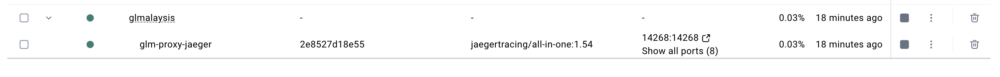
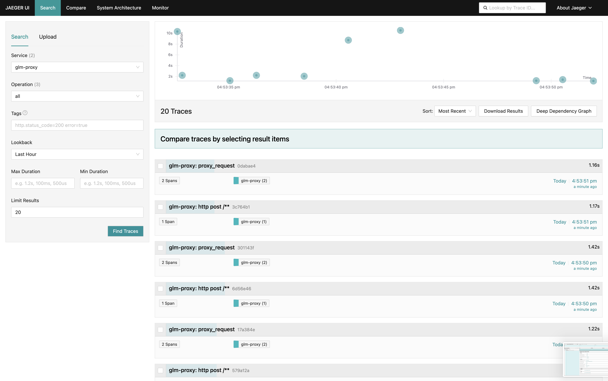
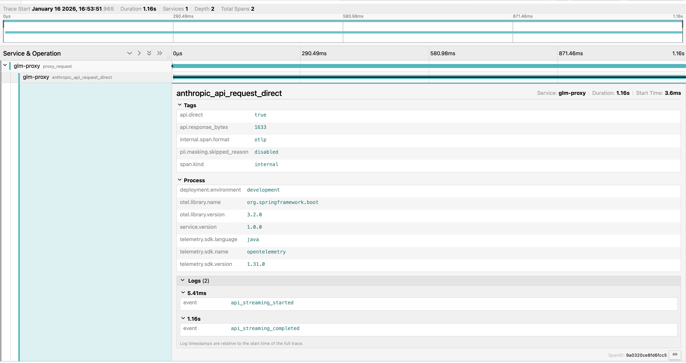

# Claude Code API 프록시 서버 만들어보기

> GLM을 써보려다 시작된 삽질의 기록

---

## 1. 시작은 호기심에서

### GLM을 Claude Code에서 써보려고 했습니다

요즘 Claude Code를 잘 쓰고 있는데, GLM(Generative Language Model)도 한번 써보고 싶었습니다. 찾아보니까 Claude Code에서 다른 API 서버를 쓸 수 있다고 하더라고요.

설치 스크립트를 뜯어보니까 핵심은 간단했습니다. `~/.claude/settings.json` 파일에서 `ANTHROPIC_BASE_URL`을 수정하면 됩니다:

```json
{
  "env": {
    "ANTHROPIC_BASE_URL": "http://localhost:8080"
  }
}
```

이걸 보는 순간 생각이 들었습니다.

**"이 URL을 내가 만든 서버로 바꾸면... 뭔가 재밌는 걸 할 수 있겠는데?"**

Claude Code가 API 서버로 뭘 보내는지 볼 수 있고, 중간에서 뭔가 처리도 할 수 있을 것 같았습니다.

---

## 2. 프록시 서버 만들기

### 기본 구조

일단 간단한 프록시 서버를 만들어봤습니다. Spring Boot + WebFlux 조합으로요.

```
Claude Code → Proxy Server (localhost:8080) → 실제 API 서버
```

### Request/Response 로깅

처음에는 단순히 로깅만 했습니다. Claude Code가 실제로 뭘 보내는지 궁금했으니까요.

```kotlin
logger.info("REQUEST INCOMING")
logger.info("Method: {}", method)
logger.info("Path: {}", path)
logger.info("Body: {}", bodyString)
```

로그를 보니까 꽤 재밌었습니다. Claude Code가 어떤 형태로 요청을 보내는지, 어떤 헤더를 쓰는지 다 보였습니다.

**내가 입력한 프롬프트가 어떻게 전송되는지도 볼 수 있었습니다.** 예를 들어 "지금 너의 claude는 proxy를 통해서 체크중이야"라고 입력하면:

```json
{
  "model": "claude-sonnet-4-5-20250929",
  "messages": [
    {
      "role": "user",
      "content": [
        {
          "type": "text",
          "text": "지금 너의 claude는 proxy를 통해서 체크중이야"
        }
      ]
    }
  ],
  "system": [
    {
      "type": "text",
      "text": "You are Claude Code..."
    }
  ],
  "max_tokens": 32000,
  "stream": true
}
```

내 입력이 `messages` 배열 안에 `role: "user"`로 들어가고, system prompt도 같이 전송되는 걸 확인할 수 있었습니다. 대화가 이어질수록 이전 메시지들이 계속 쌓여서 전송됩니다.

실제로 찍힌 로그를 보면:

```
================================================================================
REQUEST INCOMING
Timestamp: 1768550012578
Method: POST
Path: /v1/messages
Query: {beta=[true]}
Headers:
  accept: [application/json]
  anthropic-beta: [interleaved-thinking-2025-05-14]
  anthropic-dangerous-direct-browser-access: [true]
  anthropic-version: [2023-06-01]
  authorization: [Bearer ****]
  content-type: [application/json]
  user-agent: [claude-cli/2.1.9 (external, cli)]
  x-app: [cli]
  x-stainless-arch: [arm64]
  x-stainless-lang: [js]
  x-stainless-os: [MacOS]
  x-stainless-package-version: [0.70.0]
  x-stainless-runtime: [node]
  x-stainless-runtime-version: [v24.3.0]
Body (Original): {"model":"claude-sonnet-4-5-20250929","messages":[...],"stream":true}
--------------------------------------------------------------------------------
Forwarding to: https://api.z.ai/api/anthropic/v1/messages?beta=true
Streaming response from API...
```

여기서 알 수 있는 것들:
- `anthropic-beta`: Claude Code가 사용하는 베타 기능들
- `user-agent`: claude-cli 버전 정보 (2.1.9)
- `x-stainless-*`: Stainless SDK 관련 메타데이터 (Node.js 런타임, arm64 아키텍처 등)
- `stream: true`: SSE 스트리밍 응답을 요청한다는 것

### SSE 스트리밍 처리

근데 문제가 있었습니다. Claude API는 Server-Sent Events(SSE)로 응답을 스트리밍합니다. 일반적인 HTTP 응답처럼 한 번에 오는 게 아니라, 이벤트 단위로 쪼개서 옵니다.

로그를 분석해보니 **Anthropic API의 표준 SSE 이벤트 순서**가 있었습니다:

```
1. message_start       ← 메시지 시작, ID/모델 정보
2. content_block_start ← 컨텐츠 블록 시작
3. content_block_delta ← 실제 텍스트 (여러 번 반복)
4. content_block_stop  ← 컨텐츠 블록 종료
5. message_delta       ← stop_reason, 토큰 사용량
6. message_stop        ← 메시지 종료
```

실제 응답 예시:

```
event: message_start
data: {"type":"message_start","message":{"id":"msg_xxx","role":"assistant","model":"claude-sonnet-4-5-20250929"}}

event: content_block_start
data: {"type":"content_block_start","index":0,"content_block":{"type":"text","text":""}}

event: content_block_delta
data: {"type":"content_block_delta","index":0,"delta":{"type":"text_delta","text":"안녕"}}

event: content_block_delta
data: {"type":"content_block_delta","index":0,"delta":{"type":"text_delta","text":"하세요"}}

event: content_block_stop
data: {"type":"content_block_stop","index":0}

event: message_delta
data: {"type":"message_delta","delta":{"stop_reason":"end_turn"},"usage":{"output_tokens":42}}

event: message_stop
data: {"type":"message_stop"}
```

이게 화면에는 어떻게 보이냐면:

```
[message_start]     → (화면 변화 없음, 내부적으로 메시지 시작)
[content_block_start] → (화면 변화 없음, 텍스트 블록 준비)
[content_block_delta] → 안녕
[content_block_delta] → 안녕하세요
[content_block_stop]  → (화면 변화 없음, 블록 완료)
[message_delta]       → (화면 변화 없음, 토큰 사용량 등 메타데이터)
[message_stop]        → (응답 완료)
```

`content_block_delta`가 올 때마다 텍스트가 이어붙여지면서 실시간으로 타이핑되는 것처럼 보입니다. 이게 ChatGPT나 Claude 웹에서 글자가 하나씩 나타나는 효과의 원리입니다.

이 순서를 지키지 않으면 Claude Code가 응답을 제대로 파싱하지 못합니다. 이걸 제대로 프록시하려면 WebFlux의 `Flux`를 써서 스트리밍으로 전달해야 했습니다.

```kotlin
webClient
    .method(method)
    .uri(targetUrl)
    .bodyValue(bodyString)
    .retrieve()
    .bodyToFlux(DataBuffer::class.java)
    .doOnNext { buffer ->
        // 각 청크를 클라이언트로 전달
    }
```

### Request Body 포맷

Request도 정해진 포맷이 있습니다:

```json
{
  "model": "claude-sonnet-4-5-20250929",
  "messages": [
    {
      "role": "user",
      "content": [
        {"type": "text", "text": "사용자 입력"}
      ]
    }
  ],
  "system": [...],
  "tools": [...],
  "max_tokens": 32000,
  "stream": true
}
```

`messages` 배열의 `content`에는 여러 타입이 올 수 있습니다:
- `text`: 일반 텍스트
- `thinking`: AI의 생각 추적 (Extended Thinking 기능)
- `tool_use`: 도구 사용 요청
- `tool_result`: 도구 실행 결과
- `image`: 이미지

재밌는 발견은, **Claude Code가 사용하는 Write, Bash, Read 같은 도구들도 전부 이 `tool_use` 타입으로 API에 전송된다**는 것입니다. 사용자가 보는 `⏺ Bash(ls -la)` 같은 로그들이 실제로는 Request Body의 일부로 서버에 전송되는 데이터입니다.

---

## 3. [장난 1] PII 마스킹 기능 추가해보기

프록시가 잘 동작하니까 욕심이 생겼습니다. **"요청 중에 개인정보가 있으면 마스킹해서 보내면 어떨까?"**

### 왜 PII 마스킹인가?

Claude Code로 작업하다 보면 코드에 실수로 개인정보가 포함될 수 있습니다:
- API 키, 비밀번호
- 이메일 주소, 전화번호
- 주민등록번호, 카드번호

이런 정보가 그대로 API 서버로 전송되는 게 찝찝했습니다.

### Ollama 연동

로컬에서 돌릴 수 있는 LLM인 Ollama를 연동해봤습니다. 요청 본문을 Ollama에 보내서 개인정보를 감지하고 마스킹하는 방식입니다.

```yaml
pii:
  masking:
    enabled: true
    max-size: 5000  # 5KB 이하만 처리
```

### 전체 동작 흐름

```
┌─────────────────────────────────────────────────────────────────────────┐
│                         PII 마스킹 흐름도                                  │
└─────────────────────────────────────────────────────────────────────────┘

  Claude Code                 Proxy Server                    Ollama
      │                            │                            │
      │  1. POST /v1/messages      │                            │
      │  (원본 요청)                │                            │
      │ ─────────────────────────► │                            │
      │                            │                            │
      │                            │  2. PII 마스킹 요청          │
      │                            │ ─────────────────────────► │
      │                            │                            │
      │                            │     [Ollama 처리 중...]     │
      │                            │     (약 200ms ~ 5초)        │
      │                            │                            │
      │                            │  3. 마스킹된 JSON 반환       │
      │                            │ ◄───────────────────────── │
      │                            │                            │
      │                            │                       Anthropic API
      │                            │  4. 마스킹된 요청 전달         │
      │                            │ ─────────────────────────────────►
      │                            │                                  │
      │                            │  5. API 응답 (SSE 스트림)        │
      │                            │ ◄─────────────────────────────────
      │                            │
      │  6. 응답 전달 (SSE)         │
      │ ◄───────────────────────── │
      │                            │
```

### 마스킹 예시

**Before (원본):**
```json
{
  "messages": [{
    "content": "내 이메일은 hong@example.com이고 전화번호는 010-1234-5678이야"
  }]
}
```

**After (마스킹 후):**
```json
{
  "messages": [{
    "content": "내 이메일은 [EMAIL]이고 전화번호는 [PHONE]이야"
  }]
}
```

### SSE로 상태 전달

마스킹 처리 중에 사용자가 기다리지 않도록, SSE 이벤트로 상태를 먼저 보내도록 했습니다:

```
┌──────────────────────────────────────────────────────────────┐
│  Claude Code 화면에 보이는 것                                   │
└──────────────────────────────────────────────────────────────┘

1. 요청 전송 직후:
   ┌─────────────────────────────────────────┐
   │ PII masking in progress...              │  ← 즉시 표시
   └─────────────────────────────────────────┘

2. 마스킹 완료 후:
   ┌─────────────────────────────────────────┐
   │ PII masking in progress...              │
   │ Masking completed (234ms)               │  ← 마스킹 완료
   └─────────────────────────────────────────┘

3. API 응답 수신:
   ┌─────────────────────────────────────────┐
   │ PII masking in progress...              │
   │ Masking completed (234ms)               │
   │                                         │
   │ 안녕하세요! 무엇을 도와드릴까요?            │  ← 실제 응답
   └─────────────────────────────────────────┘
```

### 실제 서버 로그

```
================================================================================
PII MASKING MODE ENABLED
================================================================================
Request size: 1234 bytes (threshold: 5000 bytes)
Message ID: msg_1768550012578_1234
Starting OLLAMA processing...
--------------------------------------------------------------------------------
OLLAMA processing completed
   Duration: 234ms
   PII Masked: true
Body (Masked): {"messages":[{"content":"내 이메일은 [EMAIL]이고..."}]}
--------------------------------------------------------------------------------
Forwarding to API: https://api.anthropic.com/v1/messages
API response streaming completed
PII MASKING APPLIED: Personal information was masked
================================================================================
```

### 크기 제한

다만 요청 크기가 크면 Ollama 처리 시간이 너무 오래 걸려서, 일정 크기 이상은 마스킹 없이 바로 전달하도록 했습니다.

```
┌───────────────────────────────────────────────────────────────┐
│  요청 크기에 따른 처리 분기                                       │
└───────────────────────────────────────────────────────────────┘

                    요청 도착
                        │
                        ▼
              ┌─────────────────┐
              │ 크기 <= 5KB ?   │
              └─────────────────┘
                   │        │
                  Yes       No
                   │        │
                   ▼        ▼
          ┌────────────┐  ┌────────────┐
          │ Ollama로   │  │ 마스킹 없이 │
          │ PII 마스킹  │  │ 바로 전달   │
          └────────────┘  └────────────┘
                   │        │
                   ▼        ▼
              ┌─────────────────┐
              │   API 서버로    │
              │     전달        │
              └─────────────────┘
```

로그에서 확인:
```
# 작은 요청 (마스킹 O)
PII Masking ENABLED (size: 868 bytes <= 5000 bytes)

# 큰 요청 (마스킹 X)
PII Masking ENABLED but size too large (314876 bytes > 5000 bytes) - Skipping
```

---

## 4. [장난 2] 모니터링 환경 붙여보기

프록시가 잘 동작하는지, 어디서 시간이 오래 걸리는지 보고 싶었습니다. 분산 추적(Distributed Tracing)을 붙여보기로 했습니다.

### Docker로 Jaeger 띄우기

Jaeger는 분산 추적 시스템입니다. Docker Compose로 간단하게 띄울 수 있습니다:

```yaml
services:
  jaeger:
    image: jaegertracing/all-in-one:1.54
    ports:
      - "16686:16686"  # Jaeger UI
      - "4318:4318"    # OTLP HTTP
```

```bash
docker compose up -d jaeger
```



### OpenTelemetry 연동

Spring Boot에 OpenTelemetry를 연동해서 Trace 데이터를 Jaeger로 보냅니다.

```yaml
management:
  tracing:
    enabled: true
    sampling:
      probability: 1.0
  otlp:
    tracing:
      endpoint: http://localhost:4318/v1/traces
```

코드에서는 각 단계마다 Span을 만들어서 기록했습니다:

```kotlin
val parentSpan = tracer.nextSpan()
    .name("proxy_request")
    .tag("http.method", request.method.name())
    .tag("request.model", requestModel)

parentSpan.start()
// ... 처리 ...
parentSpan.end()
```

### Jaeger UI에서 확인

이제 Jaeger UI (http://localhost:16686)에서 요청 흐름을 볼 수 있습니다.



각 Trace를 클릭하면 상세 정보를 볼 수 있습니다:



- `proxy_request`: 전체 요청 처리
- `pii_masking`: PII 마스킹 처리 (활성화된 경우)
- `anthropic_api_request`: 실제 API 호출

각 Span에서 태그로 기록한 정보들을 볼 수 있습니다:
- `api.direct`: true (마스킹 없이 직접 호출)
- `api.response_bytes`: 1633
- `pii.masking.skipped_reason`: disabled

---

## 5. 마무리

### 이 실험의 의미: LLM을 모니터링하고 제어할 수 있습니다

이 프로젝트의 핵심은 단순한 프록시가 아닙니다. **LLM을 모니터링하고 제어할 수 있다**는 점입니다.

```
┌─────────────────────────────────────────────────────────────────────────┐
│                      프록시가 할 수 있는 것들                              │
└─────────────────────────────────────────────────────────────────────────┘

  ┌──────────────┐      ┌──────────────┐      ┌──────────────┐
  │   모니터링    │      │    제어      │      │    보호      │
  └──────────────┘      └──────────────┘      └──────────────┘
         │                     │                     │
         ▼                     ▼                     ▼
  ┌──────────────┐      ┌──────────────┐      ┌──────────────┐
  │ • 요청/응답   │      │ • 요청 수정   │      │ • PII 마스킹  │
  │   로깅       │      │ • 라우팅 변경  │      │ • 민감정보    │
  │ • 사용량 추적 │      │ • 필터링      │      │   제거       │
  │ • 성능 측정   │      │ • 캐싱       │      │ • 접근 제어   │
  └──────────────┘      └──────────────┘      └──────────────┘
```

### 1. 모니터링: LLM이 어떻게 쓰이는지 볼 수 있습니다

프록시를 통해 실제로 확인할 수 있었던 것들:

| 항목 | 확인 가능한 정보 |
|------|-----------------|
| **요청 내용** | 내가 입력한 프롬프트가 어떤 형태로 전송되는지 |
| **응답 구조** | SSE 이벤트 순서, 스트리밍 방식 |
| **도구 사용** | Write, Bash, Read 등 도구 호출 내역 |
| **토큰 사용량** | input_tokens, output_tokens |
| **처리 시간** | 각 단계별 소요 시간 (Jaeger로 시각화) |

### 2. 제어: 요청을 가로채서 수정할 수 있습니다

**PII 마스킹**이 대표적인 예입니다:
- 요청이 API 서버로 가기 전에 가로챔
- 개인정보(이메일, 전화번호 등)를 탐지
- 마스킹 처리 후 전달

```
원본: "내 이메일은 hong@example.com이야"
     │
     ▼ [프록시에서 가로채서 수정]
     │
전달: "내 이메일은 [EMAIL]이야"
```

### 3. 이 실험을 통해 알게 된 것들

1. **Claude Code의 내부 동작**
   - `settings.json`의 `ANTHROPIC_BASE_URL`만 바꾸면 프록시 가능
   - 모든 도구 사용(Write, Bash 등)이 API로 전송됨
   - SSE 스트리밍의 6단계 이벤트 순서

2. **LLM API의 구조**
   - Request: JSON (messages, system, tools, metadata)
   - Response: Server-Sent Events 스트림
   - 대화가 이어질수록 컨텍스트가 계속 쌓여서 전송됨

3. **모니터링의 중요성**
   - Jaeger로 요청 흐름을 시각화하니 병목 지점이 한눈에 보임
   - 어디서 시간이 오래 걸리는지, 에러가 어디서 나는지 파악 가능

### 마치며

처음엔 그냥 GLM 써보려고 시작한 건데, `settings.json`을 보는 순간 "이걸 프록시하면 재밌겠다"는 생각이 들었습니다.

결과적으로:
- **LLM의 내부 동작**을 직접 눈으로 확인할 수 있었고
- **요청을 가로채서 수정**하는 것도 가능하다는 걸 알았고
- **모니터링 환경**까지 붙여서 시각화할 수 있었습니다

역시 삽질은 배우는 게 많습니다.

---

## 참고

- GitHub: https://github.com/devload/glm-proxy
- 기술 스택: Spring Boot 3.x, Kotlin, WebFlux, OpenTelemetry, Jaeger, Docker
- Anthropic API Streaming 공식 문서: https://docs.anthropic.com/en/api/messages-streaming
